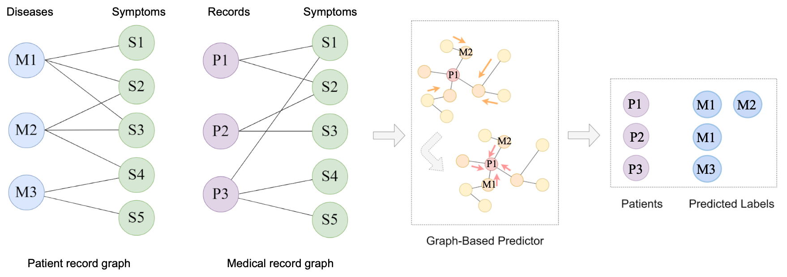

# fa22_beng183_group5
FA22 BENG183 Group 5 final project write-up/ paper on neural network by Andrew Shen, Thomas Lee, and Zichen "Cardiff" Jiang

### Neural Network Applications
Neural network, specifically graphical neural network (GNN), opens the door to many applications. In the most ubiquitous case, GNN is used by companies like Amazon and Uber to suggest products for customers to buy and to predict fraudulent transactions [1] [2]. In biological sciences, a version of GNN termed Evoformer is used by AlphaFold2 to predict, with high accuracy, protein structures that are extremely tricky to solve experimentally through X-ray crystallography or cryo-EM [3]. In pharmacology, GNN is used to discover drug side effects.

 *Figure 6*: Adaptation of Sun et al’s workflow that uses graphical neural network to predict diseases. 

We describe in detail how GNN can be used to diagnose patients. The illustration is adapted from Zhenchao Sun et al’s work that was published in the IEEE Journal of Biomedical and Health Informatics in 2020 [4]. Imagine a patient record graph with patient nodes of over a thousand features like age, sex, weight, family history, and so on that are linked with their symptoms. There is also a medical record graph of disease nodes linked with their associated symptoms through edges. These two graphs are the inputs to the graph-based predictor, a GNN. The predictor algorithm aggregates the information or messages from neighboring nodes of a patient by varying the weight of these messages. The aggregated values form a row vector that represents the patient node. This representation is called embedding. If these nodes are graphed in space, the stronger the weight for a neighbor’s message, the closer the patient node and its neighbor are pulled together. After three to five layers or rounds of aggregating information and adjusting the weights, the GNN model predicts what diseases a patient may have.
