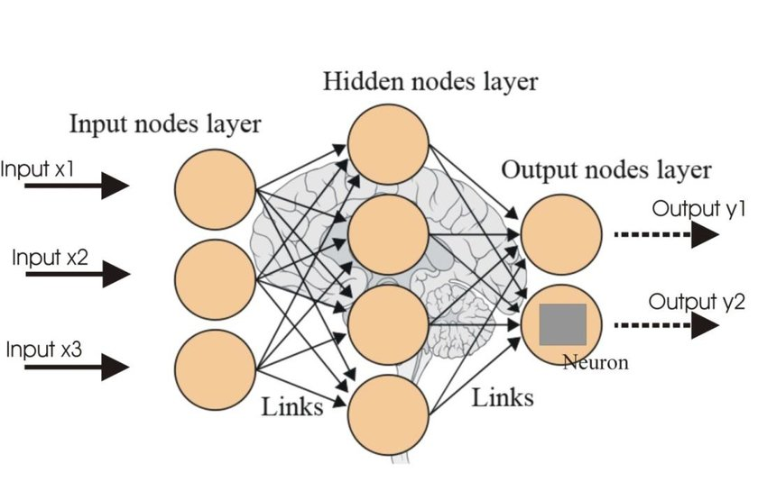
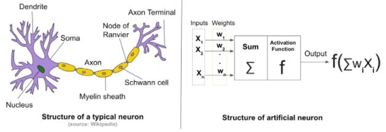
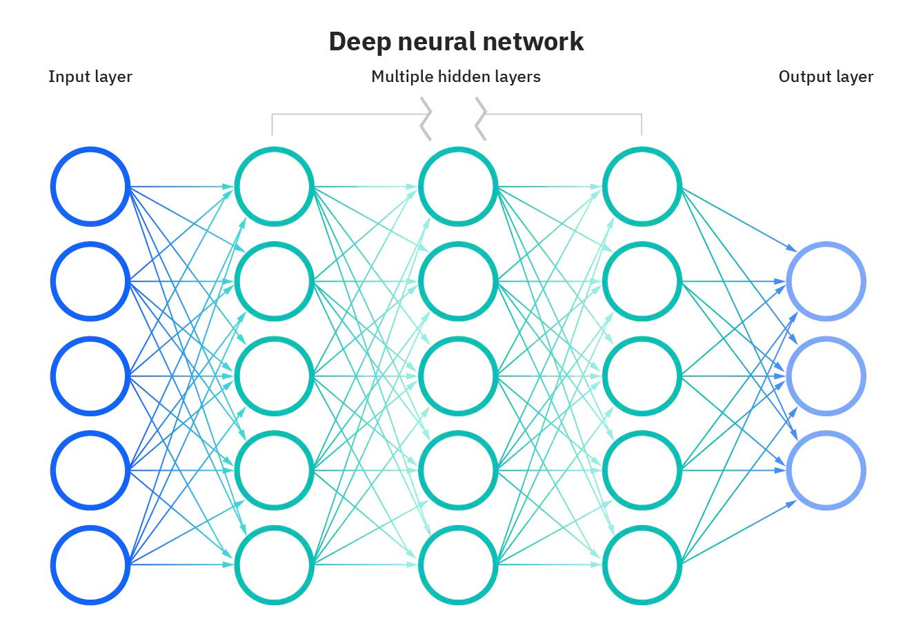

# fa22_beng183_group5
FA22 BENG183 Group 5 final project write-up/ paper on neural network by Andrew Shen, Thomas Lee, and Zichen "Cardiff" Jiang
  

### Overview

  

<b>Figure 1</b>: The potential of artificial neural networks is limitless! [7]
  

There exists many methods of supervised learning, with one example being neural networks. Neural networks are a supervised learning model based on the neural structure of the human brain. They can be used to perform classification of input data, and have much potential in the field of disease prediction.

  

### Why do we care about Neural Networks?

In class, we have discussed the power of supervised learning and its applications to perform classification. In particular, we examined the “k-nearest-neighbors” supervised learning model, which classifies points based on the most commonly found label in the “k” neighbors nearest to it. However, there are some drawbacks to k-nearest-neighbors. We have to specify the k-value beforehand, and the k-value may not be ideal for the data. In addition, the algorithm is computationally inefficient. As datasets get larger, the algorithm takes much more time to complete.

But what other supervised learning models exist? There are many other options, including support vector machines, decision trees, and neural networks. All of these models can accomplish the same task as k-nearest-neighbors, of classifying examples into different labeled categories. However, these models use different algorithms and structures to reach this final conclusion. 

We will be focusing on neural networks as an alternative method of supervised learning, and extrapolate to the application of neural networks to disease prediction.

  

### What is a Neural Network?

Neural Network, also known as Artificial Neural Network, are algorithms composed of an intricate network of nodes or neurons that model the human brain and how biological neurons communicate through signaling one another. It forms the base of deep learning, a subset of machine learning, and is often used to solve artificial intelligence problems. 

  

<b>Figure 2</b>: Overall structure of the neural network [2]
  

Neural networks composed of building blocks of layers, which comprises 3 main categories: input layer, hidden layer and output layer. The information is passed through the input layer, and moving towards the middle layer, or “hidden layer”, where the nodes train themselves to determine the patterns of the data, and ultimately predict the output for a new set of similar data [3]. Nodes in one layer are connected to the next layer through channels, or links, which are assigned with a “weighted” value. 

  

<b>Figure 3</b>: Biological neural connection vs artificial neural connection [4]
  

Let’s consider the visual learning process of the human brain as a high-level comparison between biological and artificial neural networks. Our eyes or retina would be analogous to the “input node” in the neural network, where the visual information is received to be transmitted and processed in the visual cortex of the brain, similar to the middle layers of the network [4]. As the human brain “learns” this new information, biological neurons inform each other, modified accordingly to form new connections, similar to how the nodes in an artificial neural network are trained through weight adjustment. 

The artificial neural network model is often used for classification or clustering. As the algorithms could implement both supervised and unsupervised learning methods, neural networks present highly sophisticated and powerful machine learning tools that could be used to solve complex AI problems.

  

### How do Neural Networks work?

As a reminder, the overall goal of a neural network is to reach a final prediction based on a trained model and input data. The final prediction is the results with the highest likelihood of occurring, and this likelihood is computed as the input data passes through the different layers of the model. 

To reiterate, a neural network is composed of three parts, (1) the input layer, (2) multiple hidden layers, and (3) an output layer. Each layer is composed of a node, which combines with other layers to create a web-like network of node connections. A node is a computational unit, and each node has a unique weight and threshold value. As input data is passed into a node, some set of calculations are performed and an output value is returned. If that output value is above the node’s specific threshold, then the data is passed along to another forward node. When a node is “activated” and the data is passed along, we call this process “activation.” Depending on what nodes are activated and where the data is passed along to, a predicted output is reached when the data reaches the end of the neural network [5].

  

<b>Figure 4</b>: The different layers of a deep neural network [5]
  

The function of the input layer is to take in the input data. Each data example is split up into the nodes of the input layer to be processed and passed forward. The function of the hidden layers is to perform computations and determine what data is passed forward and where the data is passed. Finally, the function of the output layer is to predict the final classification label for the input data.

Here is an example visualization of a neural network performing classification of an input data case. The input data is an image, and the function of the neural network is to classify what number is represented in the image. Each of the 784 pixels of the image are fed into one of the 784 nodes in the input layer. The data is propagated forward through the hidden layers until the highest probability result is revealed, which in this example is 2.
  

<b>Figure 5</b>: Example visualization of neural network classifying image data [9]

  

### Neural Network Applications
Neural network, specifically graphical neural network (GNN), opens the door to many applications. In the most ubiquitous case, GNN is used by companies like Amazon and Uber to suggest products for customers to buy and to predict fraudulent transactions [1] [2]. In biological sciences, a version of GNN termed Evoformer is used by AlphaFold2 to predict, with high accuracy, protein structures that are extremely tricky to solve experimentally through X-ray crystallography or cryo-EM [3]. In pharmacology, GNN is used to discover drug side effects.
  

  <b>Figure 6</b>: Adaptation of Sun et al’s workflow that uses graphical neural network to predict diseases.

  

We describe in detail how GNN can be used to diagnose patients (Fig. 6). The illustration is adapted from Zhenchao Sun et al’s work that was published in the IEEE Journal of Biomedical and Health Informatics in 2020 [4]. Imagine a patient record graph with patient nodes of over a thousand features like age, sex, weight, family history, and so on that are linked with their symptoms. There is also a medical record graph of disease nodes linked with their associated symptoms through edges. These two graphs are the inputs to the graph-based predictor, a GNN. The predictor algorithm aggregates the information or messages from neighboring nodes of a patient by varying the weight of these messages. The aggregated values form a row vector that represents the patient node. This representation is called embedding. If these nodes are graphed in space, the stronger the weight for a neighbor’s message, the closer the patient node and its neighbor are pulled together. After three to five layers or rounds of aggregating information and adjusting the weights, the GNN model predicts what diseases a patient may have.

  

### References
1. IBM Cloud Education. “What Are Neural Networks?” IBM, https://www.ibm.com/cloud/learn/neural-networks. 
2. Era-Iitk. “Brain and Artificial Neural Networks: Differences and Similarities.” Medium, Medium, 7 June 2020, https://medium.com/@eraiitk/brain-and-artificial-neural-networks-differences-and-similarities-1d337fe50168. 
3. Bernard Marr. “What Is an Artificial Neural Networks?” Bernard Marr, 13 July 2021, https://bernardmarr.com/what-is-an-artificial-neural-networks/. 
4. Mijwil, Maad M. “Artificial Neural Networks Advantages and Disadvantages.” LinkedIn, 9 Mar. 2018, https://www.linkedin.com/pulse/artificial-neural-networks-advantages-disadvantages-maad-m-mijwel/. 
5. Gfycat. “Best Neural Network Gifs.” Gfycat, https://gfycat.com/gifs/search/neural+network. 
6. Wang, Zichen, and Vassilis N. Ioannidis. “How AWS Uses Graph Neural Networks to Meet Customer Needs.” Amazon Science, Amazon Science, 24 Mar. 2022, https://www.amazon.science/blog/how-aws-uses-graph-neural-networks-to-meet-customer-needs. 
7. Wang, Zichen, and Vassilis N. Ioannidis. “How AWS Uses Graph Neural Networks to Meet Customer Needs.” Amazon Science, Amazon Science, 24 Mar. 2022, https://www.amazon.science/blog/how-aws-uses-graph-neural-networks-to-meet-customer-needs. 
8. Jumper, John, et al. “Highly Accurate Protein Structure Prediction with Alphafold.” Nature, vol. 596, no. 7873, 2021, pp. 583–589., https://doi.org/10.1038/s41586-021-03819-2. 
9. Sun, Zhenchao, et al. “Disease Prediction via Graph Neural Networks.” IEEE Journal of Biomedical and Health Informatics, vol. 25, no. 3, 2021, pp. 818–826., https://doi.org/10.1109/jbhi.2020.3004143. 
